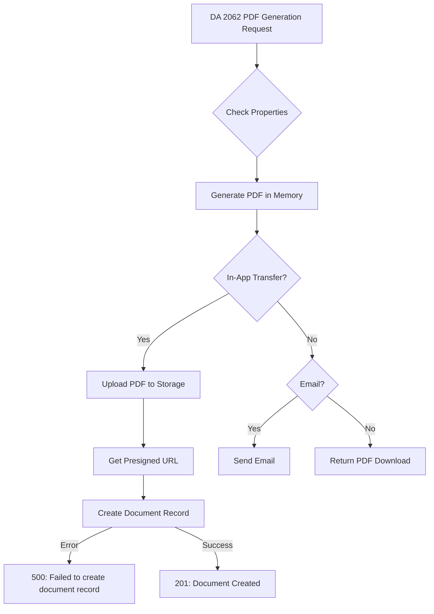

# DA 2062 PDF Generation Error Fix

## Problem Summary

When attempting to generate a DA 2062 hand receipt PDF (especially when sending it to another user in-app), the backend returns an HTTP 500 error with the message **"Failed to create document record."**

### Root Cause

The `documents` table is missing from the database. This table is required to store metadata about generated DA 2062 forms when they are sent to other users in the app.

## Solution Overview

The fix involves creating the missing `documents` table in the PostgreSQL database. This table stores:
- Document metadata (type, title, sender/recipient)
- Form data as JSONB
- Attachment URLs (for the generated PDFs)
- Status tracking (unread/read/archived)

## Fix Implementation

### Option 1: Local Development (Docker)

Run the fix script from the backend directory:

```bash
cd backend
chmod +x scripts/fix-da2062-documents-table.sh
./scripts/fix-da2062-documents-table.sh
```

This script will:
1. Check if PostgreSQL container is running
2. Check if documents table exists
3. Create the table if missing
4. Verify the schema
5. Optionally restart the backend

### Option 2: Azure Deployment

For Azure PostgreSQL, use the Azure-specific script:

```bash
# Set connection details
export AZURE_DB_HOST=your-server.postgres.database.azure.com
export AZURE_DB_USER=your-username@your-server
export AZURE_DB_PASSWORD=your-password
export AZURE_DB_NAME=handreceipt

# Run the fix
chmod +x backend/scripts/fix-azure-da2062-documents.sh
./backend/scripts/fix-azure-da2062-documents.sh
```

After running the script, restart your Azure Container App:
```bash
az containerapp revision restart --name handreceipt-backend --resource-group <your-rg>
```

### Option 3: Manual SQL Execution

If you prefer to run the SQL manually:

```sql
-- Create documents table for DA2062 and maintenance forms
CREATE TABLE IF NOT EXISTS documents (
    id SERIAL PRIMARY KEY,
    created_at TIMESTAMP WITH TIME ZONE DEFAULT CURRENT_TIMESTAMP,
    updated_at TIMESTAMP WITH TIME ZONE DEFAULT CURRENT_TIMESTAMP,
    deleted_at TIMESTAMP WITH TIME ZONE,
    type VARCHAR(50) NOT NULL,
    subtype VARCHAR(50),
    title VARCHAR(255) NOT NULL,
    sender_user_id INTEGER NOT NULL,
    recipient_user_id INTEGER NOT NULL,
    property_id INTEGER,
    form_data TEXT,
    description TEXT,
    attachments JSONB DEFAULT '[]'::jsonb,
    status VARCHAR(50) NOT NULL DEFAULT 'unread',
    sent_at TIMESTAMP WITH TIME ZONE NOT NULL,
    read_at TIMESTAMP WITH TIME ZONE,
    CONSTRAINT fk_documents_sender FOREIGN KEY (sender_user_id) REFERENCES users(id),
    CONSTRAINT fk_documents_recipient FOREIGN KEY (recipient_user_id) REFERENCES users(id),
    CONSTRAINT fk_documents_property FOREIGN KEY (property_id) REFERENCES properties(id)
);

-- Create indexes for better performance
CREATE INDEX IF NOT EXISTS idx_documents_sender_user_id ON documents(sender_user_id);
CREATE INDEX IF NOT EXISTS idx_documents_recipient_user_id ON documents(recipient_user_id);
CREATE INDEX IF NOT EXISTS idx_documents_property_id ON documents(property_id);
CREATE INDEX IF NOT EXISTS idx_documents_status ON documents(status);
CREATE INDEX IF NOT EXISTS idx_documents_type ON documents(type);
CREATE INDEX IF NOT EXISTS idx_documents_sent_at ON documents(sent_at);
CREATE INDEX IF NOT EXISTS idx_documents_deleted_at ON documents(deleted_at);
```

## Verification

### 1. Check Table Exists

The backend provides an endpoint to check if the documents table exists:

```bash
curl http://localhost:8080/api/da2062/table-check
```

Expected response when fixed:
```json
{
  "documents_table_exists": true,
  "document_count": 0,
  "timestamp": "2024-01-15T10:30:00Z",
  "message": "Table exists and is accessible"
}
```

### 2. Test PDF Generation

After applying the fix:
1. Open the iOS app
2. Select properties for a DA 2062
3. Choose a recipient from your connections
4. Generate and send the PDF

The response should be 201 Created with the document details.

### 3. Check Backend Logs

Monitor the backend logs for successful document creation:

```bash
# Docker
docker-compose logs -f app | grep -i document

# Azure
az containerapp logs show --name handreceipt-backend --resource-group <your-rg> --follow
```

## Technical Details

### DA 2062 Generation Flow



### Document Table Schema

The `documents` table stores:
- **type**: Document type (e.g., 'transfer_form')
- **subtype**: Specific form type (e.g., 'DA2062')
- **title**: Human-readable title
- **sender_user_id**: User who created the document
- **recipient_user_id**: User who receives the document
- **attachments**: JSONB array of file URLs
- **status**: Document status (unread/read/archived)

## Prevention

To prevent this issue in future deployments:

1. **Always run migrations** after deploying new code
2. **Include migration checks** in deployment scripts
3. **Use a migration tracking system** to ensure all migrations are applied
4. **Test the deployment** in a staging environment first

## Related Files

- Migration: `sql/migrations/013_add_documents_table.sql`
- Handler: `backend/internal/api/handlers/da2062_handler.go`
- Fix Scripts:
  - `backend/scripts/fix-da2062-documents-table.sh` (Local/Docker)
  - `backend/scripts/fix-azure-da2062-documents.sh` (Azure)
  - `backend/scripts/create_documents_table.sql` (Manual SQL) 